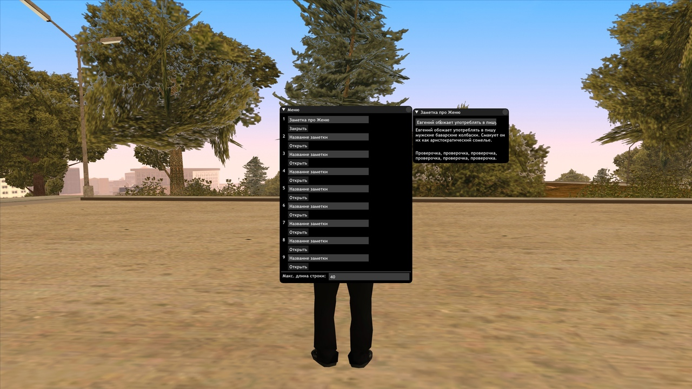

# fyo-notepad

Скачать текущую версию скрипта для:
  * SA-MP 0.3.7-R1: https://github.com/xxekichsiht/fyo-notepad/releases/download/v1.0/fyo-notepad-v1.0.rar
  * SA-MP 0.3DL-R1: https://github.com/xxekichsiht/fyo-notepad/releases/download/03dl-v1.0/fyo-notepad-03dl-v1.0.rar

Установка:
  1. Установить CLEO — https://cleo.li/cleo4/CLEO4.1_setup.exe  
  2. Установить SAMPFUNCS — https://www.blast.hk/attachments/22939  
     (если используете версию 0.3DL-R1, пропустите этот пункт)
  3. Установить Moonloader — https://www.blast.hk/moonloader/download.php  
     (при установке поставьте галочку напротив пункта "установить ASI Loader")

Инструкция по использованию:
  * '/note' — открыть меню скрипта
  * '/note {номер заметки}' — открыть заметку с указанным номером в 0.3.7-R1  
    (пример: '/note 1')
  * '/note-{номер заметки}' — открыть заметку с указанным номером в 0.3DL-R1  
    (пример: '/note-1')
  * Чтобы передвигать заметки на экране, откройте чат (чтобы на экране появился курсор)
    
Обратите внимание, что скрипт работает только для версий 0.3.7-R1 и 0.3DL-R1!

Как выглядит в игре:

